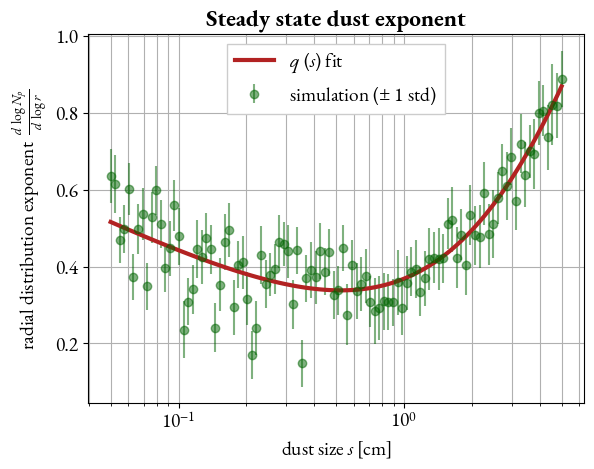

# Notes
## Terminal commands
* `mpirun -n N ./pluto` run PLUTO with N processors.
* `mpirun -n N ./pluto &` + `disown -h` run PLUTO in detached mode.
* `ps aux | grep mpi` see running processes. Second column is the ID of the process.
* `kill -9 'ID'` kill process 'ID'.

## Pipeline

We want to calculate the average force $F_0$, but with particles we only have

$$
F(t)=F_0+\tilde F(t)
$$

where $\tilde F $ is a random variable with gaussian distribution and variance that diminishes with number of particles $var(\tilde F)=<\tilde F(t)^2>=f(N_{p})$. It's not feasible to just grow the number of particles (simulation too slow and memory issues) so we do this:

1. Reach stationary regime (constant particle count) $t>t_s$
2. Measure force $F$ every regular interval $\delta t$
    * $\delta t$ such that $<\tilde F(t) \tilde F(t+\delta t)=0>$ (uncorrelated)
3. Stop after $N_{\delta t} \delta t$ and calculate the average force $F_{avg}$

$$
F_{avg}=\frac{1}{N_{\delta t}}\sum_{k=0}^{N_{\delta t}} F(t_k)=F_0 + \frac{\sum_k \tilde F_k}{N_{\delta t}}
$$

the average error is given by
$$
\sqrt{var(F_{avg}-F_0)}=\frac{var(\tilde F)}{\sqrt{N_{\delta t}}} 
$$

## Dust initial conditions

The dust radial density $\sigma_d(r)$ at stationary conditions is well described by the law

$$
\sigma_d(r)\propto \left( \frac{r}{r_0}\right)^{q(s)}
$$

The exponent $q(s)$ is determined by analyzing particle count distributions at stationary regime. This is the fitted exopnent:

An empyrical law that fits the simulations is:

$$
q(s)=1.162 \log_{10} \left( \left( \frac{s}{\text{2 cm}}\right)^{1.000}+\left( \frac{s}{\text{2 cm}}\right)^{-0.258} \right)
$$

The stationary dust density in the injection region has a different distribution: the particles drift to the center but are generated randomly in the region, this creates a density that goes to zero at the outer radius $r_o$ and matches $\sigma_d$ at the damping radius $r_d$. This can be accounted for by a factor $K(r)$ that multiplies $\sigma_d$:

$$
K(r)=
\begin{cases}
1 \ &\text{if} \ r<r_d\\
\frac{r_o-r}{r_d-r_o} &\text{if} \ r_o<r<r_d \\
0 \ &\text{if} \ r>r_d\\
\end{cases}
$$

To generate the particles' radii according to the steady state distribution, the rejection method is used. A convenient normalization of the probability density function is

$$
f(r)=K(r)\left( \frac{r}{r_d}\right)^{q(s)}
$$

this is convenient because the maximum of the function is $f(r_d)=1$. The algorithm is then:

1. Generate two random numbers $r\in [r_i,r_o]$ and $x\in [0,1]$.
2. Calculate $f(r)$.
3. If $x<f(r)$ then $r$ is kept, otherwise it's discarded.